# flask-catalog

Portfolio project to demonstrate a Flask based implementation of a secure user model with registration, email confirmation, and Google oauth2 login, combined with an example catalog of items grouped in categories. Registered users can CRUD the catalog via a web front-end or via a REST API that adheres strictly to the  [JSON API 1.0](http://jsonapi.org/) specification. The REST API supports advanced searching and filtering. End 2 end scenarios are demonstrated via a python client written in a [Jupyter notebook](http://jupyter.org/).

# Deployed on Heroku

The application is deployed on https://flask-catalog.herokuapp.com/, so please follow along and interact with the front end via a browser or interact with the back end via API calls.


# Front End

------

##### Home: https://flask-catalog.herokuapp.com/


The home page shows a Jumbotron with some branding, three buttons (Visit, Register, Log in), credit to content providers and a copyright at the bottom. 

Note the favicon icon in the browser tab, which shows a beer stein, since the catalog is populated with beers.


------

##### Main page - categories: [https://flask-catalog.herokuapp.com/catalog/categories/1/items](https://flask-catalog.herokuapp.com/catalog/categories/1/items)


When you click the Visit>> button on the home page, you are directed to the main page of the catalog, where you see the current content of the catalog. 

The Categories are listed on the left side of the page, while the beers (items) that belong to the selected category are listed on the right side.


------

##### Main page - items: [https://flask-catalog.herokuapp.com/catalog/categories/1/items/4/](https://flask-catalog.herokuapp.com/catalog/categories/1/items/4/)

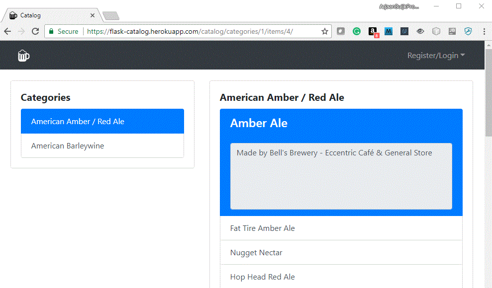

When you click on a beer in the list on the right side, a redirection takes place to the selected item in the selected category. The example image shows how the selected beer is always shown at the top of the list, with an expanded view where the description is given.


------

##### Navbar & Windows collapse:  [https://flask-catalog.herokuapp.com/catalog/categories/1/items/4/](https://flask-catalog.herokuapp.com/catalog/categories/1/items/4/)


When you change the browser window size, notice how the Navbar is nicely collapsing and how the lists of Categories and Items are re-organizing themselves vertically.

This pretty much completes what a visitor of the catalog can do without logging in.


------

##### Register/Login dropdown


When a user is not authenticated, the Navbar shows a dropdown on the right side that provides options for Register and Log in. 


------

##### Login:  [https://flask-catalog.herokuapp.com/login](https://flask-catalog.herokuapp.com/login)

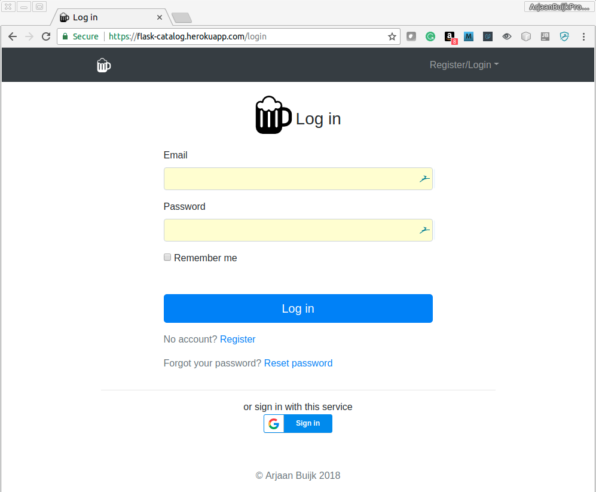

The login page can be reached from the home page or from the Navbar dropdown.

As the image shows, one can login with an email & password, but that requires you to first register an account. A more convenient approach is to sign in with the service listed at the bottom, which uses Google OAUTH2 to authenticate you and log you in. Please first login with your google account.


------

##### Google Login


When you click on the Google Sign in button, you will be asked to authenticate yourself with a gmail address. Upon successful authentication, the flask-catalog application will verify on the server side that all is indeed OK by making a call to the Google OAUTH2 API. If all is fine, your email will be registered as a confirmed user, and you will be logged in. 


------

##### Main page - Logged In: https://flask-catalog.herokuapp.com/catalog/categories/1/items

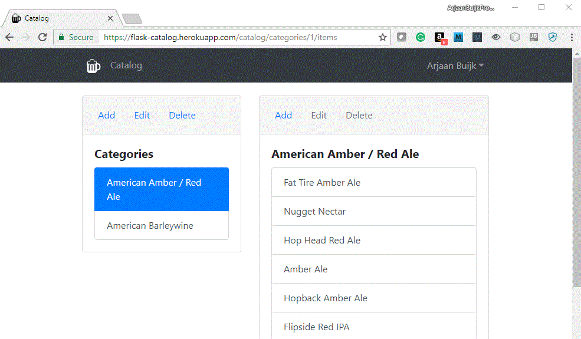


Once logged in, you will be redirected to the main page of the categories with the first category selected. 

Note that above both the categories and the items lists you can find options to **Add, Edit or Delete**. The Edit and Delete options for the items are deactivated until you select an item. This is also indicated by a tooltip 'Please select an item first' when you hover the mouse above them.

Also note that the Navbar has changed. A link is added to get back to this main page, and the dropdown  now shows your name.


------

##### Edit Category that you do not own: [https://flask-catalog.herokuapp.com/catalog/categories/1/edit](https://flask-catalog.herokuapp.com/catalog/categories/1/edit)

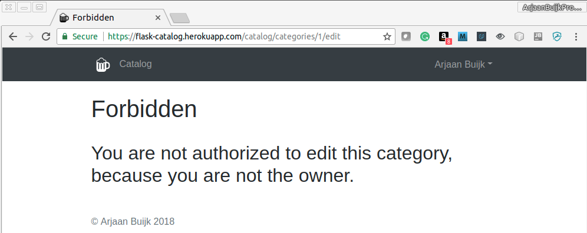

When you try to edit the first Category, you will be redirected to a custom 403.html page that looks like the image shown. This will happen for Edit & Delete actions on **categories and items** that you do not own.


------

##### Add Category: [https://flask-catalog.herokuapp.com/catalog/categories/add](https://flask-catalog.herokuapp.com/catalog/categories/add)

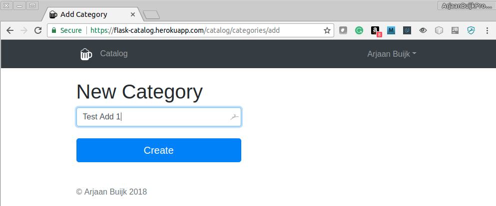

So, lets add a Category to our beer catalog. When clicking the add link, it brings up a page where you can fill out the name of the new category, and then click Create.

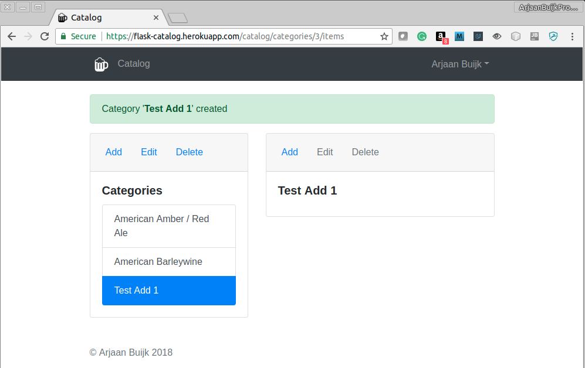

The new category is added to the database, and you will be redirected to a page that shows all the items in this new category, which off course is an empty list for now.

Note that a message is flashed back to you to confirm that the category was added.


------

##### Add Item: [https://flask-catalog.herokuapp.com/catalog/categories/3/items/add](https://flask-catalog.herokuapp.com/catalog/categories/3/items/add)


Lets add some beers to our new category, by clicking on the Add link in the right column. This brings up a page where you can fill out the name of the new beer with a description, and then click Create. 

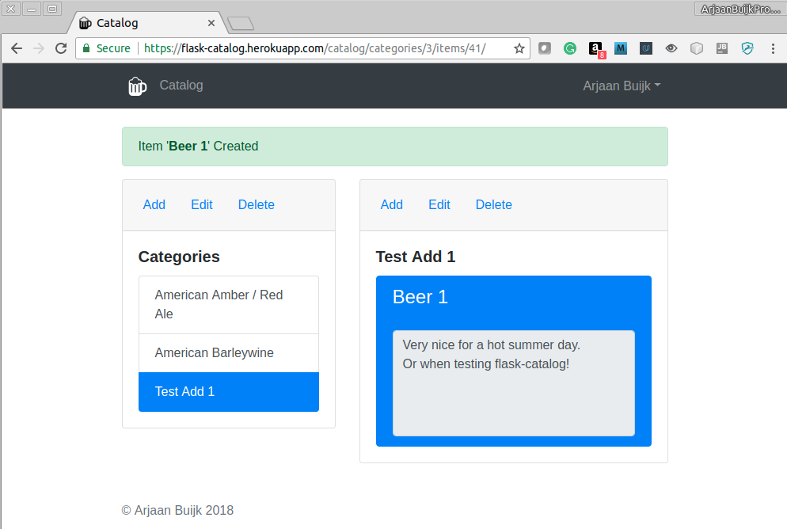

The new beer is added to the database, and you will be redirected to a page that shows all the items in the category, with the newly selected beer selected and shown at the top of the page.

Note that a message is flashed back to you to confirm that the category was added.

Lets try this again:

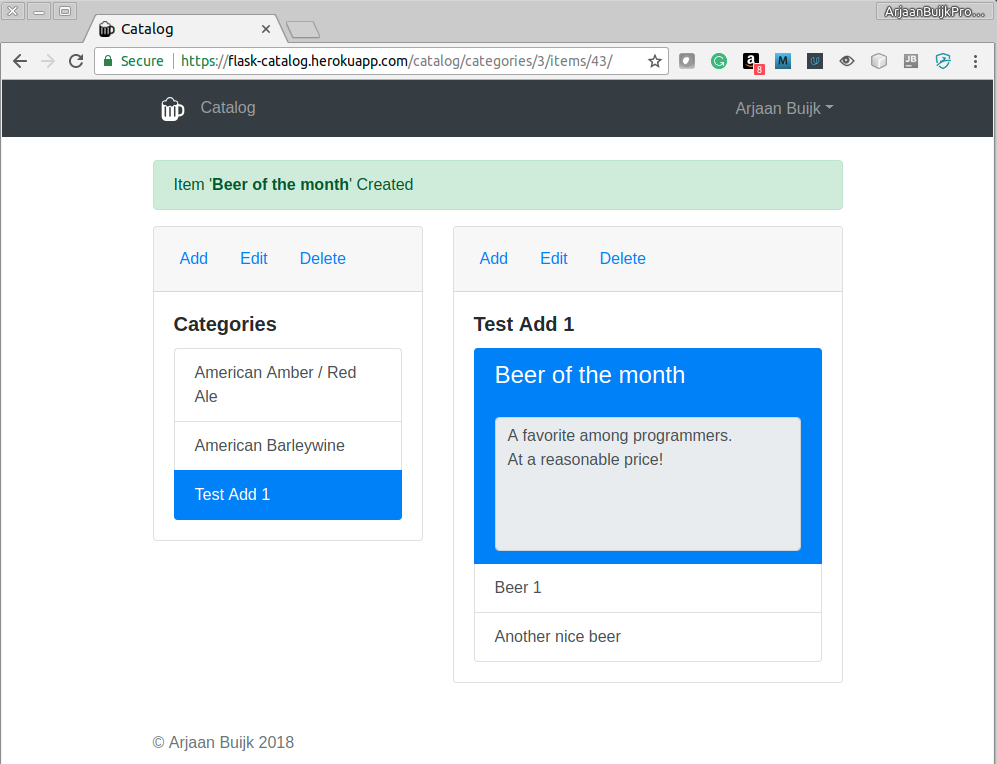

Note how the latest beer you add always is automatically selected and shown at the top of the list.

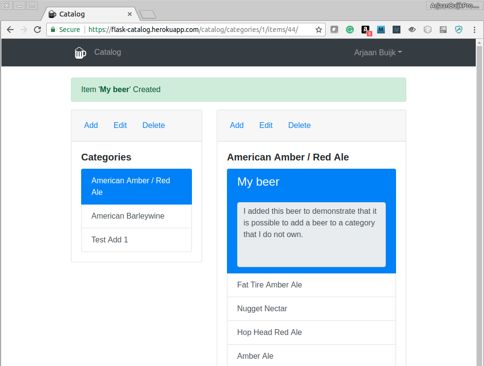

You are allowed to also add new beers to a category that you do not own. This comes with a danger though, because when the owner of the category deletes that category (see below) or decides to delete the account altogether, all the beers of that category will be deleted.


------

##### Edit an owned item: [https://flask-catalog.herokuapp.com/catalog/categories/3/items/42/edit](https://flask-catalog.herokuapp.com/catalog/categories/3/items/42/edit)

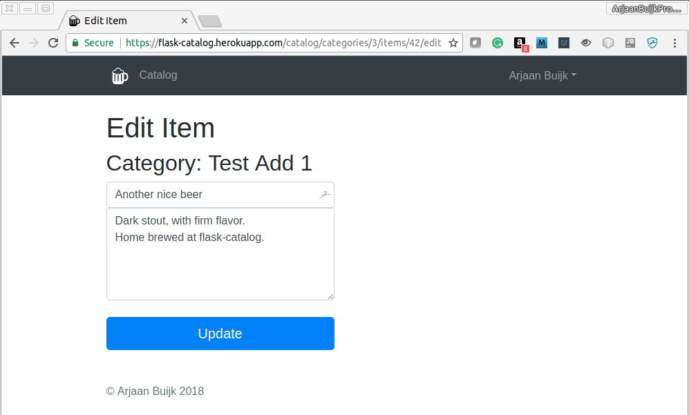

Any category or item that you own can be edited, as shown here for an item.


------

##### Delete an owned category or item:


When you click on the Delete link for an owned category or item, the application will first ask for confirmation. If you click on Delete, it will go ahead and delete the selected Category or Item. When you delete a category it will also delete all the items in it. Once done, a message is flashed back.


------

##### Logged in user dropdown: 

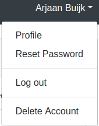

As a logged in user, you have access to some user options to update your profile, reset your password, log out or delete your account. Lets try them all out.


------

##### Profile: [https://flask-catalog.herokuapp.com/user/profile](https://flask-catalog.herokuapp.com/user/profile)


On the profile page, the logged in user can update the profile picture, email, first name and last name. Since I logged in with Google, the profile picture that I have stored with my Google account is used, but if I want I can upload another picture. 


------

##### Reset Password: 


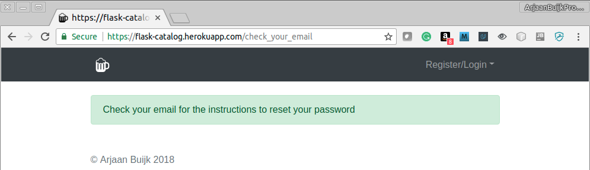


When selecting Reset Password from the dropdown in the Navbar while logged in, the application will send you an email, and display a message to check your your email, which looks like this:

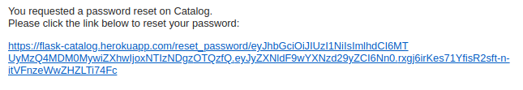

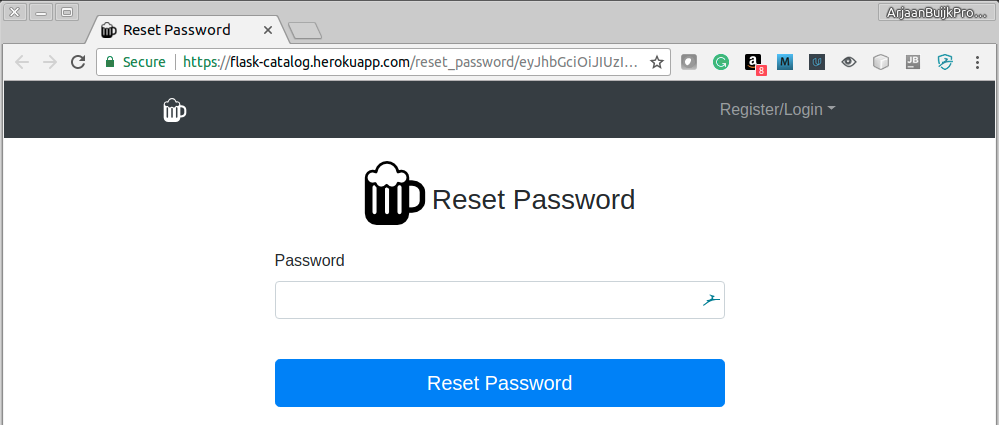

When you click on the link in the email, you will be redirected to a form where you can reset your password. Note that in case the registration/login was done with Google OAUTH2, this will be the first time you set your password, so it is not a reset it the literal sense. Once a password has been set, you will then be able to login without Google OAUTH2 and use the applications authentication method.


------

##### Delete account:


When you select Delete Account, the application will first ask for confirmation. If you click on Delete, it will go ahead and delete the categories you own, including all the items in it (even those you do not own), the  Items you added to non-owned cateogires, and finally your user account will be deleted. 

Once done, a message is flashed back.


------

##### Register: [https://flask-catalog.herokuapp.com/register](https://flask-catalog.herokuapp.com/register)

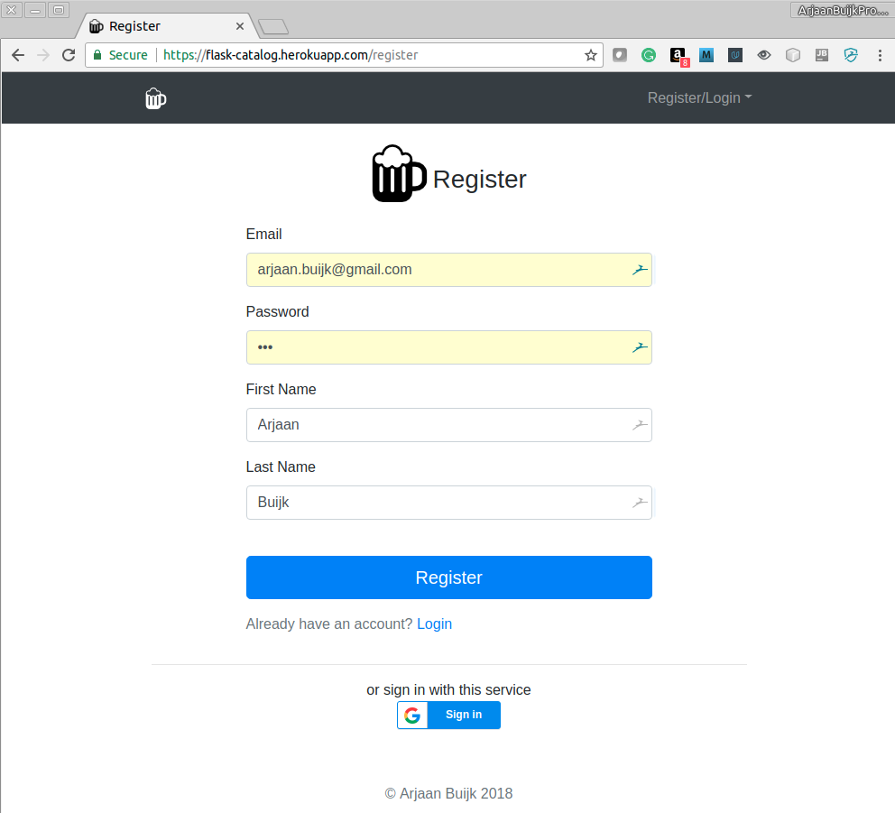

After deletion of the account, now lets explore registration without using Google OAUTH2. Click on **Register>>** on the home page, and you will be redirected you to the registration page, where you are asked to provide your email and password together with First Name and Last Name. 

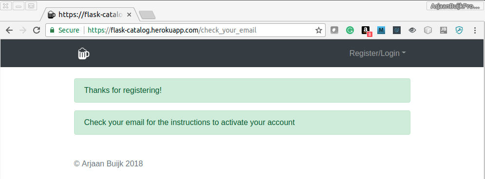

When you click Register, your account will be created, but not yet activated. The application will send you an email, and display a message to check your your email, which looks like this:

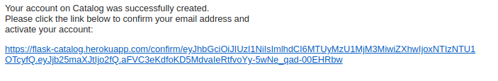

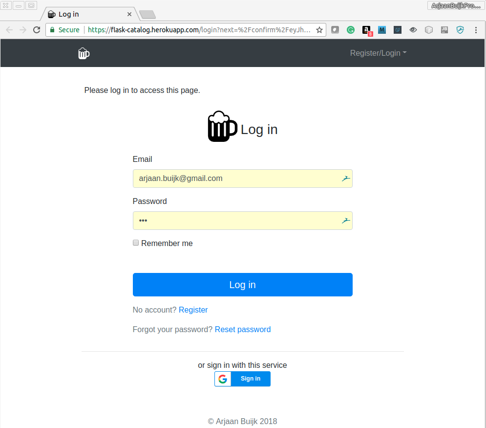


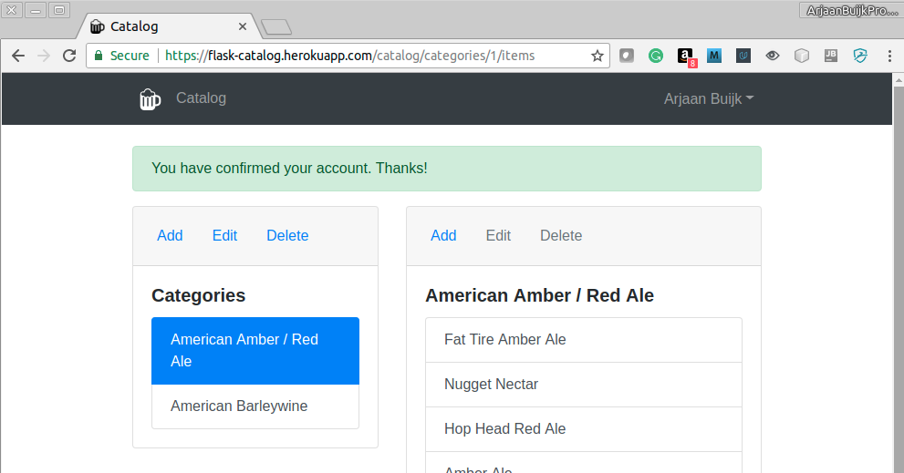

When you click on the link in the email, you will first be asked to login, and if that is successful, your account will be activated.


# Back End

The API was developed using a very nice flask extension called [Flask-REST-JSONAPI](http://flask-rest-jsonapi.readthedocs.io/en/latest/). Implementing an API with this extension is a bit more involved than just providing some endpoints that return json, but it gives tremendous capability once finished. For example, it provides automatically:

- JSON responses that adhere strictly to the  [JSON API 1.0](http://jsonapi.org/) specification.
- Links in the JSON responses to related object, complying with the REST requirement of *discoverability*.
- Pagination of JSON responses that involve lists.
- Powerful filtering capability.

The implementation of the API are best documented via examples. You can try them out by running this Jupyter notebook from your computer:

```bash
(venv) $ cd test
(venv) $ jupyter notebook e2e_REST_API_small_demo_heroku.ipynb
```

This will open up the Jupyter notebook in your default browser, and you can run the commands.

You can view an executed notebook, exported as HTML [here](https://flask-catalog.herokuapp.com/static/docs/e2e_REST_API_all_localhost.html).

In the examples it is shown that every API call is authenticated, either with user+password, or by means of a JWT token.

To get all the categories you can use this request in python:

```python
url = SERVER+'/api/v1/categories/'
headers = get_api_headers(token,'')
r = requests.get(url, headers=headers)
```

Utilities are provided in the Jupyter notebook to print the request and response, and the output is:

```json
=================================
===THE REQUEST WE SENT===
=================================

--------------------------------------------------------------
REQUEST METHOD and URL:
GET https://flask-catalog.herokuapp.com/api/v1/categories/

REQUEST HEADER:
{ 'Accept': 'application/vnd.api+json',
  'Accept-Encoding': 'gzip, deflate',
  'Authorization': 'Basic '
                   'ZXlKaGJHY2lPaUpJVXpJMU5pSXNJbWxoZENJNk1UVXlNelkxTXpJMk5Td2laWGh3SWpveE5USXpOalUyT0RZMWZRLmV5SnBaQ0k2TTMwLlJaVmg5cUEtTVpFd21IZ1BwaURDMDdtU0JvYTBpNUNpUk5UdE92VWQ1OEk6',
  'Connection': 'keep-alive',
  'Content-Type': 'application/vnd.api+json',
  'User-Agent': 'python-requests/2.18.4'}

REQUEST BODY:
request.body is empty
--------------------------------------------------------------
=================================
===THE RESPONSE WE RECEIVED===
=================================

--------------------------------------------------------------
RESPONSE STATUS CODE:
200

RESPONSE HEADER:
{ 'Connection': 'keep-alive',
  'Content-Length': '705',
  'Content-Type': 'application/json, application/vnd.api+json',
  'Date': 'Fri, 13 Apr 2018 21:01:23 GMT',
  'Server': 'gunicorn/19.7.1',
  'Via': '1.1 vegur'}

RESPONSE TEXT (Body):
{ 'data': [ { 'attributes': { 'name': 'American Amber / Red Ale',
                              'timestamp': '2018-04-11T21:16:20.990182+00:00'},
              'id': '1',
              'links': {'self': '/api/v1/categories/1'},
              'relationships': { 'user': { 'links': { 'related': '/api/v1/categories/1/user',
                                                      'self': '/api/v1/categories/1/relationships/user'}}},
              'type': 'category'},
            { 'attributes': { 'name': 'American Barleywine',
                              'timestamp': '2018-04-11T21:16:21.099433+00:00'},
              'id': '2',
              'links': {'self': '/api/v1/categories/2'},
              'relationships': { 'user': { 'links': { 'related': '/api/v1/categories/2/user',
                                                      'self': '/api/v1/categories/2/relationships/user'}}},
              'type': 'category'}],
  'jsonapi': {'version': '1.0'},
  'links': {'self': 'https://flask-catalog.herokuapp.com/api/v1/categories/'},
  'meta': {'count': 2}}
--------------------------------------------------------------
```

Similar examples are provided to get the details of a certain category or item.


# Framework & Extensions

The application is written in [Python 3](https://www.python.org/) using the [Flask](http://flask.pocoo.org/)  microframework, with following extensions.

- [Flask-REST-JSONAPI](http://flask-rest-jsonapi.readthedocs.io/en/latest/)
- [Flask-SQLAlchemy](http://flask-sqlalchemy.pocoo.org)
- [Flask-Bcrypt](https://flask-bcrypt.readthedocs.io/en/latest/)
- [Flask-HTTPAuth](https://flask-httpauth.readthedocs.io/en/latest/)
- [Flask-Login](https://flask-login.readthedocs.io/en/latest/)
- [Flask-Mail](https://pythonhosted.org/Flask-Mail/)
- [Flask-Uploads](https://pythonhosted.org/Flask-Uploads/)


The front-end HTML pages are generated with:

- [Flask-WTF](https://flask-wtf.readthedocs.io)
- [Bootstrap V4.0.0](https://getbootstrap.com/) (*)


The end-2-end test client is written in Python with following extensions:

- [requests](http://docs.python-requests.org/en/master/)
- [Pillow](https://pillow.readthedocs.io/en/latest/)


(*) We do not install Bootstrap V4.0.0, but use a CDN.


# Installation

Development and testing was done on Ubuntu 16.04, using Python 3.6.2, to be compatible with environment deployed on heroku.

The steps described here show how to run locally within a python virtual environment.

**Step 1. Clone the project repository**
```bash
$ git clone https://github.com/ArjaanBuijk/FullstackND-Catalog.git
```

**Step 2. Configure project**
Define the environment variables in a **.env** file, including the following variables:

```bash
SECRET_KEY = '<create-a-secret-key>'
BCRYPT_LOG_ROUNDS = <an integer>

# Using gmail (FOR EXAMPLE. REPLACE WITH OWN SMTP SERVER)
MAIL_SERVER = 'smtp.googlemail.com'
MAIL_PORT = 465
MAIL_USE_TLS = False
MAIL_USE_SSL = True
MAIL_USERNAME = '------@gmail.com'
MAIL_PASSWORD = '#########'
MAIL_DEFAULT_SENDER = '-------@gmail.com'

# We initialize one ADMIN, one USERMANAGER and one USER
ADMIN_EMAIL = '--------'
ADMIN_PW = '------------'
ADMIN_FIRST_NAME = 'Default'
ADMIN_LAST_NAME = 'Admin'

USERMANAGER_EMAIL = 'um@example.com'
USERMANAGER_PW = '---------------'
USERMANAGER_FIRST_NAME = 'Default'
USERMANAGER_LAST_NAME = 'Usermanager'

USER_EMAIL = 'us@example.com'
USER_PW = '--------------'
USER_FIRST_NAME = 'Default'
USER_LAST_NAME = 'User'

# Uploads

IMAGE_DEST = 'application/static/uploads/img'
DEFAULT_DEST = 'application/static/uploads'

# Google OAUTH2
# You have to register the app with Google yourself and then copy/paste the credentials
# json into this environment variable. 
# Make sure to use TRUE JSON, with " ", not ' '
GOOGLE_OAUTH2_ENV = '{"web":{"client_id":"-----------","project_id":"-------------","auth_uri":"---------","token_uri":"-----------","auth_provider_x509_cert_url":"---------------","client_secret":"--------------","redirect_uris":["http://localhost:5000/categories/"]}}'
GOOGLE_OAUTH2_FILE_PATH = '<just-a-name>.json'
```

Note that for security reasons this configuration file is not included in the github repository.

**Step 3. One time: make sure python3-pip and python3-env are installed**
```bash
$ sudo apt install python3-pip
$ sudo apt-get install python3-venv
```

**Step 4. One time: prepare the python3 virtual environment** 
```bash
$ cd Catalog
$ python3.6 -m venv venv
$ source venv/bin/activate
(venv)
(venv) $ pip install --upgrade pip
(venv) $ pip install -r requirements.txt
```

Alternatively, instead of installing the required python packages using the file 'requirements.txt', which installs the specific versions that were used during development and testing, you can also enter these commands, to install the latest version of each package. Using this script has an advantage in that it also installs and configures the **Jupyter notebook**.
```bash
$ cd Catalog
$ python3.6 -m venv venv
$ source venv/bin/activate
(venv) $ ./pip_all.sh

This installs the following into our virtual environment:
---------------------------------------------------------
##########################################
## Verify we are running the proper pip ##
##########################################
which pip
pip install --upgrade pip

##########################################
## Install flask and all the extensions ##
##########################################
pip install flask
pip install Flask-REST-JSONAPI
pip install flask-sqlalchemy
pip install flask-migrate
pip install flask-httpauth
pip install flask-login
pip install flask-mail
pip install flask-uploads
pip install Flask-WTF

############################################################
## Install additional python packages used by application ##
############################################################
pip install oauth2client
pip install python-dotenv

##########################################
## Install python packages for e2e test ##
##########################################
pip install requests
pip install Pillow

###########################################
## Install Jupyter notebook for e2e test ##
###########################################
pip install jupyter
pip install ipykernel
python3 -m ipykernel install --user

###########################
## Install PEP8 checkers ##
## - Pylint              ##
## - pycodestyle         ##
## - pep8                ##
###########################
pip install pylint
pip install pep8
pip install pycodestyle

################################
## Install gunicorn webserver ##
################################
pip install gunicorn

############################################################################
## Install package that allows SQLAlchemy to connect to Postgres database ##
############################################################################
pip install psycopg2

```

**Step 5. Activate the python virtual environment and start the application server**

This will start the application with a clean and fresh database that contains only the default content:

```bash
$ cd FullstackND-Catalog
$ source venv/bin/activate
(venv) $ export FLASK_APP=catalog.py
(venv) $ ./reset_db_migrations.sh
(venv) $ flask run
```

You will see this output printed to the console:

```bash
 * Serving Flask app "catalog"
 * Running on http://127.0.0.1:5000/ (Press CTRL+C to quit)
```


For end-2-end testing, a Jupyter notebook with the python 3 kernel is used. 
This must be installed and configured with:

```bash
(venv) $ pip install --upgrade pip
(venv) $ pip install jupyter
(venv) $ pip install ipykernel
(venv) $ python3 -m ipykernel install --user
```

For validating python syntax, pylint is used. This can be installed with:

```bash
(venv) $ pip install --upgrade pip
(venv) $ pip install pylint
```

