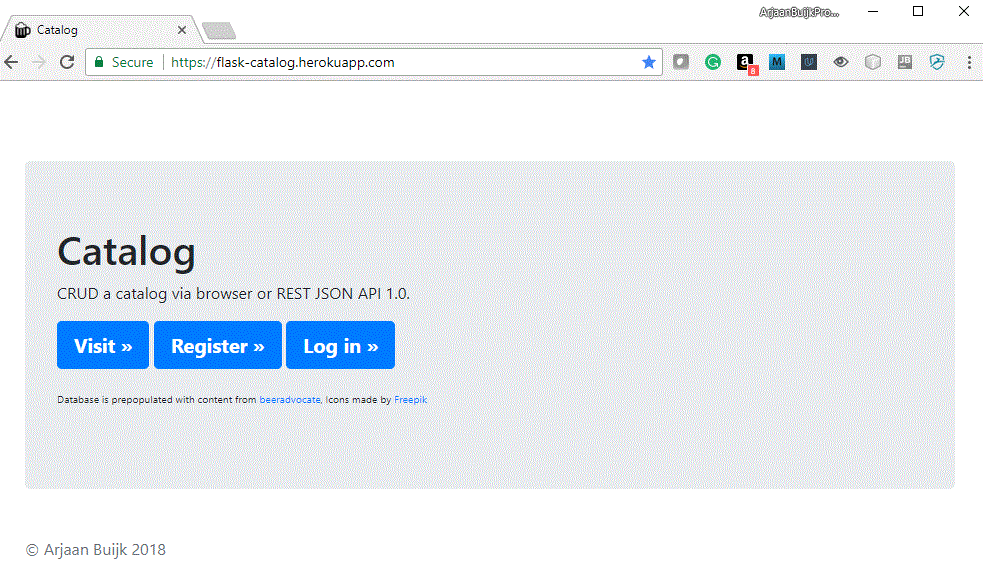
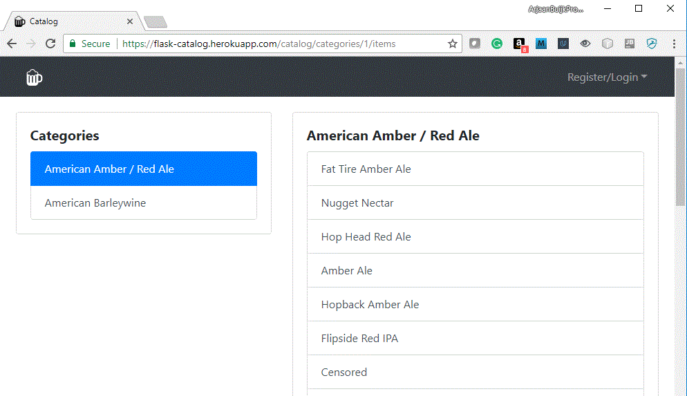
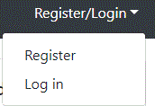
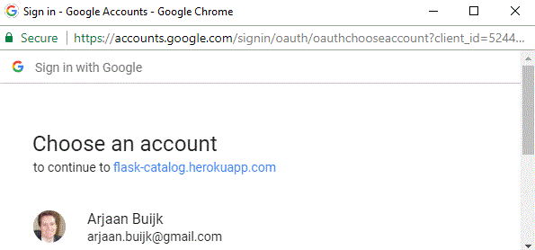

# flask-catalog

Portfolio project to demonstrate a Flask based implementation of a secure user model with registration, email confirmation, and Google oauth2 login, combined with an example catalog of items grouped in categories. Registered users can CRUD the catalog via a web front-end or via a REST API that adheres strictly to the  [JSON API 1.0](http://jsonapi.org/) specification. The REST API supports advanced searching and filtering. End 2 end scenarios are demonstrated via a python client written in a [Jupyter notebook](http://jupyter.org/).

### Deployed on Heroku

The application is deployed on https://flask-catalog.herokuapp.com/, so please follow along and visit the pages.

------

##### Home: https://flask-catalog.herokuapp.com/



The home page shows a Jumbotron with some branding, three buttons (Visit, Register, Log in), credit to content providers and a copyright at the bottom. 

Note the favicon icon in the browser tab, which shows a beer stein, since the catalog is populated with beers.

------

##### Main page - categories: [https://flask-catalog.herokuapp.com/catalog/categories/1/items](https://flask-catalog.herokuapp.com/catalog/categories/1/items)



When you click the Visit>> button on the home page, you are directed to the main page of the catalog, where you see the current content of the catalog. 

The Categories are listed on the left side of the page, while the beers (items) that belong to the selected category are listed on the right side.

------

##### Main page - items: [https://flask-catalog.herokuapp.com/catalog/categories/1/items/4/](https://flask-catalog.herokuapp.com/catalog/categories/1/items/4/)


When you click on a beer in the list on the right side, a redirection takes place to the selected item in the selected category. The example image shows how the selected beer is always shown at the top of the list, with an expanded view where the description is given.

------

##### Navbar & Windows collapse:  [https://flask-catalog.herokuapp.com/catalog/categories/1/items/4/](https://flask-catalog.herokuapp.com/catalog/categories/1/items/4/)


When you change the browser window size, notice how the Navbar is nicely collapsing and how the lists of Categories and Items are re-organizing themselves vertically.

This pretty much completes what a visitor of the catalog can do without logging in.

------

##### Register/Login dropdown



When a user is not authenticated, the Navbar shows a dropdown on the right side that provides options for Register and Log in. 

------

##### Login:  [https://flask-catalog.herokuapp.com/login](https://flask-catalog.herokuapp.com/login)


The login page can be reached from the home page or from the Navbar dropdown.

As the image shows, one can login with an email & password, but that requires you to first register an account. A more convenient approach is to sign in with the service listed at the bottom, which uses Google OAUTH2 to authenticate you and log you in. Please first login with your google account.

------

##### Google Login




When you click on the Google Sign in button, you will be asked to authenticate yourself with a gmail address. Upon successful authentication, the flask-catalog application will verify on the server side that all is indeed OK by making a call to the Google OAUTH2 API. If all is fine, your email will be registered as a confirmed user, and you will be logged in. 

------

##### Main page - Logged In: https://flask-catalog.herokuapp.com/catalog/categories/1/items


Once logged in, you will be redirected to the main page of the categories with the first category selected. 

Note that above both the categories and the items lists you can find options to **Add, Edit or Delete**. The Edit and Delete options for the items are deactivated until you select an item. This is also indicated by a tooltip 'Please select an item first' when you hover the mouse above them.

Also note that the Navbar has changed. A link is added to get back to this main page, and the dropdown  now shows your name.

------

##### User dropdown for Profile, Logout, Delete


Without authentication, only the main page can be visited which displays the catalog content.

1. Users can create an account and login, in several ways:

   1. At the home page, by providing email & password.

   2. At the home page, with a Google account.

   3. With an API request, by providing email & password

      *(NOTE: The API does not yet support authentication with a Google account)*

   ​

2. All API calls are authenticated. 

3. New users need to verify their account by email. Users are not able to log in until this verification is complete.

4. There are three roles with different permission levels: 
   (-) a regular user, who is only able to CRUD their own records
    (-) a user manager, who is able to CRUD only users
    (-) an admin, who is able to CRUD all records and users

5. When a user fails to log in three times in a row, his or her account will be blocked automatically, and only admins and managers are able to unblock it.

6. An admin is able to invite someone to the application by specifying an email address; the system will send an invitation message automatically, prompting the user to complete the registration by setting first name, last name, and password.

7. Users are able to upload and change their profile picture.

8. Users can post 'meals', and each meal has a date, time, text, and number of catalog.

9. If the number of catalog is not provided, the API will connect to [Nutritionix](https://www.nutritionix.com) and try to get the number of catalog for the entered meal.

10. In a user setting, a target number of catalog per day is defined.

11. When retrieving the details for a meal an extra boolean field is set to true if the total for that day is less than expected number of catalog per day, otherwise it will be false.

12. The API return data according to the [JSON API 1.0](http://jsonapi.org/) specification

13. The API provides filter capabilities for all endpoints that return a list of elements, and supports pagination.

14. The API filtering allows definition of operations precedence and use any combination of the available fields.

15. The application includes rigorous unit tests.

16. End 2 end scenarios are tested via a python client written in a [Jupyter notebook](http://jupyter.org/)


### Framework & Extensions

The application is written in [Python 3](https://www.python.org/) using the [Flask](http://flask.pocoo.org/)  microframework, with following extensions.

- [Flask-REST-JSONAPI](http://flask-rest-jsonapi.readthedocs.io/en/latest/)
- [Flask-SQLAlchemy](http://flask-sqlalchemy.pocoo.org)
- [Flask-Bcrypt](https://flask-bcrypt.readthedocs.io/en/latest/)
- [Flask-HTTPAuth](https://flask-httpauth.readthedocs.io/en/latest/)
- [Flask-Login](https://flask-login.readthedocs.io/en/latest/)
- [Flask-Mail](https://pythonhosted.org/Flask-Mail/)
- [Flask-Uploads](https://pythonhosted.org/Flask-Uploads/)


The front-end HTML pages are generated with:

- [Flask-WTF](https://flask-wtf.readthedocs.io)
- [Bootstrap V4.0.0](https://getbootstrap.com/) (*)


The end-2-end test client is written in Python with following extensions:

- [requests](http://docs.python-requests.org/en/master/)
- [Pillow](https://pillow.readthedocs.io/en/latest/)


(*) We do not install Bootstrap V4.0.0, but use a CDN.

### API usage

The API is demonstrated in this [end-2-end test scenario](link-to-HTML).

(The link is an HTML export of this [Jupyter notebook](link-to-notebook) after all cells were run.)


### Installation

Development and testing was done on Ubuntu 16.04, using Python 3.6.2, to be compatible with environment deployed on heroku.

The steps described here show how to run <b>catalog</b> within a python virtual environment.

**Step 1. Clone the project repository**
```bash
$ git clone https://github.com/ArjaanBuijk/Catalog.git
```

**Step 2. Configure project**
Install the secret configuration file into: Catalog/instance/config.py
Note that for security reasons this configuration file is not included in the github repository.

**Step 3. One time: make sure python3-pip and python3-env are installed**
```bash
$ sudo apt install python3-pip
$ sudo apt-get install python3-venv
```

**Step 4. One time: prepare the python3 virtual environment**
```bash
$ cd Catalog
$ python3.6 -m venv venv
$ source venv/bin/activate
(venv)
(venv) $ pip install --upgrade pip
(venv) $ pip install -r requirements.txt
```

 Alternatively, instead of installing the required python packages using the file 'requirements.txt', which installs the specific versions that were used during development and testing, you can also enter these commands, to install the latest version of each package:
```bash
$ cd Catalog
$ python3.6 -m venv venv
$ source venv/bin/activate
(venv) $ ./pip_all.sh

This installs the following into our virtual environment:
---------------------------------------------------------
##########################################
## Verify we are running the proper pip ##
##########################################
which pip
pip install --upgrade pip

##########################################
## Install flask and all the extensions ##
##########################################
pip install flask
pip install Flask-REST-JSONAPI
pip install flask-sqlalchemy
pip install flask-migrate
pip install flask-bcrypt
pip install flask-httpauth
pip install flask-login
pip install flask-mail
pip install flask-uploads
pip install Flask-WTF

############################################################
## Install additional python packages used by application ##
############################################################
pip install oauth2client
pip install python-dotenv

##########################################
## Install python packages for e2e test ##
##########################################
pip install requests
pip install Pillow

###########################################
## Install Jupyter notebook for e2e test ##
###########################################
pip install jupyter
pip install ipykernel
python3 -m ipykernel install --user

####################
## Install Pylint ##
####################
pip install pylint

################################
## Install gunicorn webserver ##
################################
pip install gunicorn

############################################################################
## Install package that allows SQLAlchemy to connect to Postgres database ##
############################################################################
pip install psycopg2

```

**Step 5. Activate the python virtual environment and start the application server**
```bash
$ cd Catalog
$ source venv/bin/activate
(venv) $ export FLASK_APP=catalog.py
(venv) $ flask run
```

 You will see this output printed to the console:
 ```bash
 Connecting to existing data-base...
 * Serving Flask app "catalog"
 * Running on http://127.0.0.1:5000/ (Press CTRL+C to quit)
 ```

### Notes for developer

**Start with a clean database**

To start with a clean and fresh database, just remove the existing database before starting the application:

```bash
$ cd Catalog
$ source venv/bin/activate
(venv) $ rm app.db
(venv) $ export FLASK_APP=catalog.py
(venv) $ flask run
```

You will see this output printed to the console:

```bash
 Creating & initializing a new data-base...
 * Serving Flask app "catalog"
 * Running on http://127.0.0.1:5000/ (Press CTRL+C to quit)
```


For end-2-end testing, a Jupyter notebook with the python 3 kernel is used. 
This must be installed and configured with:

```bash
(venv) $ pip install --upgrade pip
(venv) $ pip install jupyter
(venv) $ pip install ipykernel
(venv) $ python3 -m ipykernel install --user
```

For validating python syntax, pylint is used. This can be installed with:

```bash
(venv) $ pip install --upgrade pip
(venv) $ pip install pylint
```

